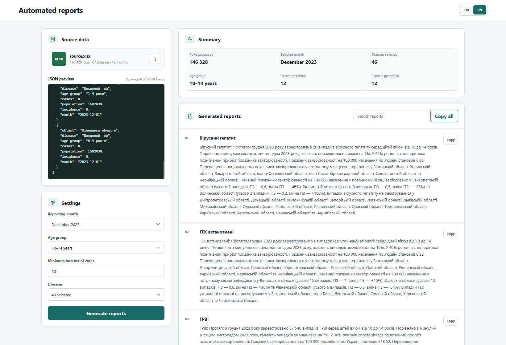

# Automated Reports

A browser-based application that converts a prepared epidemiological dataset into standardized monthly reports. It provides report settings, a source-data preview, processing summary, and ready-to-copy reports.

[Open the live application](https://konsttantin.github.io/automated-reports/)



## Features

- Preview the source data in JSON format and download the demo Excel file.
- Select a reporting month, age group, minimum case threshold, and diseases.
- Generate standardized Ukrainian-language reports from the selected parameters.
- Review a summary of the processed data and generated results.
- Search reports and copy them individually or all at once.
- Switch the application interface between English and Ukrainian.

## How It Works

The application loads prepared monthly JSON data derived from the included Excel dataset. It filters the records using the selected settings, compares the results with the previous month, identifies regions above the national incidence rate, and generates a report for each disease that passes the case threshold.

## Getting Started

Requirements: Node.js and npm.

```bash
git clone https://github.com/Konsttantin/automated-reports.git
cd automated-reports
npm ci
npm run dev
```

Open the local address shown by Vite in your browser.

To create a production build:

```bash
npm run build
```

## Limitations

- The application uses the included demo dataset.
- Uploading custom files through the interface is not supported.
- A different dataset must be prepared in the structure expected by the application before it can be used.
